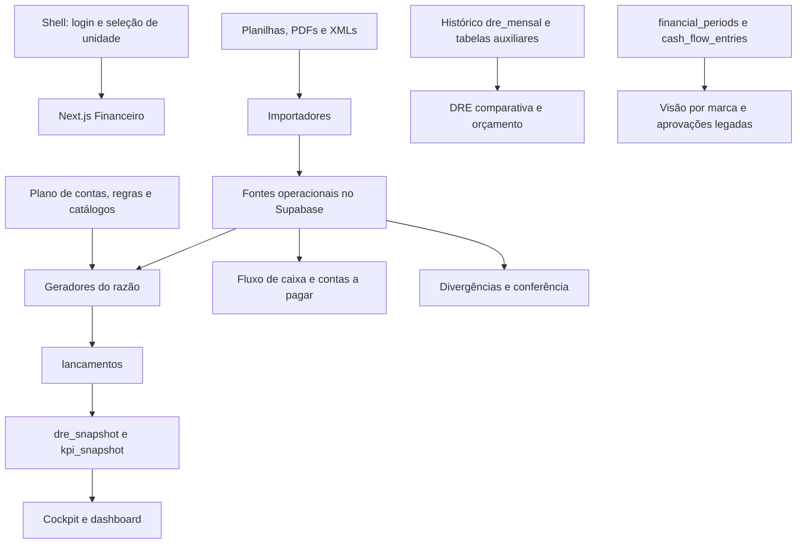

> Este documento registra a auditoria inicial, antes das correções. Para o comportamento corrigido e a validação, veja [CORRECOES_E_VALIDACAO.md](CORRECOES_E_VALIDACAO.md).

# Mapa do maza-financeiro

Levantamento do código local em 17/09/2026. Este documento descreve a implementação encontrada; comentários históricos não comprovam o estado atual do banco ou do deploy.

## Escopo e limites

Inventário: 48 páginas, 24 handlers de API e 41 migrations em `supabase/migrations`, além do histórico de SQL em `sql/`. Foram rastreados os fluxos centrais de autenticação, importação, razão, indicadores, contas a pagar, fluxo de caixa, conferência, produtos e contratos. Não houve alteração funcional, aplicação de migrations, reprocessamento real ou consulta a dados de produção. Não se trata de uma certificação de todos os comportamentos da aplicação.

## Arquitetura

- Next.js 16.2.4, App Router, React 19.2.4, TypeScript com configuração estrita.
- Server Components carregam dados; componentes cliente oferecem filtros, gráficos, modais e importadores. Server Actions e Route Handlers fazem as mutações.
- Supabase fornece Postgres, Auth e Storage. Há clientes com sessão do usuário e clientes privilegiados com service role.
- `lib/maza` contém implementações locais de autenticação, acesso a dados e UI. Os aliases `@maza/*` apontam para esses arquivos pelo `tsconfig.json`; não são pacotes externos neste repo.
- Tailwind 4, estilos globais Maza, componentes Base UI, Recharts, Lucide e Sonner compõem a interface.
- XLSX/ZIP/XML/PDF são processados por bibliotecas locais. A importação de determinados PDFs de receita usa Anthropic, modelo configurado `claude-sonnet-4-6`.
- Desenvolvimento na porta 3001. O Shell central é uma dependência externa: login, navegação e encaminhamento de rotas. `assetPrefix: /financeiro` mantém os assets desta aplicação separados dos assets do Shell.
- `/dashboard` e `/financeiro` usam o mesmo `CockpitDashboard`. A integração esperada com o outro repositório está descrita em `docs/DASHBOARD.md`.

## As camadas financeiras que coexistem

| Camada | Fonte principal | Uso |
| --- | --- | --- |
| Razão unificado | `lancamentos`, `plano_contas`, `regras_classificacao` | Projeção das fontes operacionais por competência |
| Cockpit | `kpi_snapshot`, `dre_snapshot`, `metas`, `v_fonte_saude` | Indicadores e evolução de seis meses; unidade ou consolidado |
| DRE histórica | `dre_mensal`, `dre_linhas_detalhadas`, `dre_kpis_mensais` e auxiliares | Orçado versus realizado e detalhamento histórico |
| Despesas por linha | `titulos_a_pagar`, `mapa_conta_dre`, `titulo_override` | Detalhes de ocupação, utilidades e demais linhas via APIs |
| Financeiro por marca | `financial_periods`, `cash_flow_entries`, `financial_projections` e views | Lançamentos manuais, projeções e pedidos de aprovação |
| Caixa | Títulos, pagamentos de receita, folha, contas e movimentos bancários | Desembolso e recebimento; não lê a DRE para calcular saldo |

Essas camadas não são intercambiáveis. Não foi encontrado sincronismo geral que torne uma importação imediatamente visível em todas elas.

## Autenticação, unidade e navegação

Pontos de entrada: `src/middleware.ts`, `lib/maza/auth/server.ts`, `lib/maza/auth/unit.ts`, `lib/maza/auth/context.tsx`, `src/app/financeiro/layout.tsx` e `src/app/auth/sso/callback/route.ts`.

O middleware redireciona para o login central se não encontra um cookie cujo nome contenha `auth-token`. O callback SSO valida `token_hash` com `verifyOtp`. `requireUser()` usa `getCurrentUser()`, que obtém a sessão e consulta papéis em `user_roles`.

A unidade vem do cookie `maza_unit_id`, com compatibilidade para `kph_unit_id`. O servidor procura uma unidade ativa acessível ou escolhe a primeira. O provider recebe a unidade resolvida pelo servidor, para evitar que a preferência antiga do navegador descreva dados de outra unidade.

O menu é obtido do `/api/nav` do Shell, com cache de 60 segundos, timeout de três segundos e menu local de fallback. Há inconsistência entre os fallbacks de domínio: navegação usa `maza-maza.vercel.app`, enquanto o login/SSO usa `maza.vercel.app`.

## Importação e rastreabilidade

| Origem | Implementação | Destino e particularidades |
| --- | --- | --- |
| NF-e XML | `src/lib/nfe/parser.ts`; `src/app/financeiro/dre/cmv/actions.ts` | `nfe_importacoes`, `nfe_documentos`, `produtos_relatorio`; identificação por CNPJ, direção entrada/saída e chave |
| Compras e contas a pagar atuais | `src/lib/financeiro/importacao/compras/` | `titulos_a_pagar`, origens `nf_pedidos` e `contas_pagar`; reposição por unidade, origem e competência; roteamento especial para IKY Delivery |
| Pacotes Maza ZIP/XLSX | `src/lib/financeiro/importacao/maza/`; API `financeiro/importacao-maza/preview` | Preview, checksum, preservação do arquivo em Storage e auditoria em `financeiro_importacoes`; commit no mesmo endpoint |
| Receita diária Lorean | `src/app/api/receita/import*` | `receita_dias` e detalhes de pagamentos, produtos, ambientes, turnos, horários, descontos e usuários |
| Receita PDF | `src/lib/receita/vendaExtract.ts` | Extração por IA; depende de `ANTHROPIC_API_KEY`; JSON validado parcialmente na extração |
| Vendas consolidadas | `src/app/api/vendas-consolidado/`; `src/lib/vendas/spreadsheet-parser.ts` | Tabelas por período, produtos e funcionários; outro nível de agregação |
| Folha Domínio | `src/lib/folha/dominio/` | PDF por posições de texto, colaborador e rubrica; resolução de CNPJ com papel `folha`; tabelas `payroll_extrato_dominio_*` |
| Títulos Everest | `src/lib/pagar-import/`; API `financeiro/pagar/import` | Adaptador de títulos com campos do ERP e referências legadas |
| Protestos | `src/lib/protestos/`; `src/app/financeiro/pagar/protestos-actions.ts` | Certidão PDF, registros individuais e arquivo preservado em Storage |

Os adaptadores não têm todos as mesmas regras de substituição, identidade e classificação. Em particular, o pacote Maza ainda grava títulos como `PLANILHA MAZA`, origem excluída pelos cálculos atuais de razão e caixa.

## Regras do razão e indicadores

Núcleo: `src/lib/financeiro/razao/gerar.ts`. As Server Actions de `src/app/financeiro/razao/actions.ts` e o script `scripts/regerar-razao.ts` chamam essa mesma implementação.

`gerarRazao` executa NF-e, títulos, folha, receita e, por último, snapshots. Cada etapa devolve seu resultado; o snapshot é tentado mesmo quando uma etapa anterior falha.

- NF-e de entrada: custo por item, classificação pelo capítulo NCM e ligação ao catálogo. Notas com total zero ou R$ 0,01 são tratadas como bonificação e excluídas. Itens sem chave NF-e não entram nesta projeção.
- Receita: bruta diária e deduções de descontos/cancelamentos. Gorjeta é tratada como repasse. Não inventa taxa de cartão a partir dos pagamentos. O mapeamento de contas de receita está fixo para Yoshimori e IKY.
- Títulos: competência definida por emissão da nota encontrada, depois lançamento, depois vencimento. Classificação prioriza categoria gerencial e depois fornecedor/descrição. Sem regra, conta `9.99`.
- Deduplicação de compras: fornecedor do catálogo + número da nota + valor com tolerância de 2% + mesma competência. Quando encontra cobertura por XML, o título não gera outro custo. Alimentos/bebidas de contas a pagar são descartados quando existe cobertura de NF_PEDIDOS naquela unidade/competência.
- Folha: rubricas de provento mapeadas a salários, férias/13º e pró-labore, mais FGTS. Descontos não compõem custo, exceto rubrica 843 de INSS empregador. Rubricas desconhecidas vão para `9.99`.
- Quando há extrato de folha, determinados títulos de pagamento de pessoal são classificados fora dos KPIs para evitar duplicidade; sem extrato há fallback de mão de obra.
- Receita líquida = receita bruta − deduções. EBITDA = receita líquida − CMV − mão de obra − despesas operacionais. Resultado líquido = EBITDA − financeiro − impostos sobre lucro.
- Percentuais de custos e margens usam receita líquida; ticket médio usa receita bruta/clientes.
- O indicador de CMV é baseado em compras, sem um fechamento geral de consumo por estoque inicial + entradas − estoque final nesta projeção.
- Confiança combina 40% de classificação, 30% de saúde das fontes e 30% de cobertura XML das compras. A saúde das fontes é global, não por unidade.
- A interface diferencia dado ausente, zero e indicador parcial; testes existentes cobrem parte dessa apresentação.

O cockpit consolida explicitamente duas unidades, Yoshimori e IKY. Metas não são combinadas no consolidado. A estrutura de marcas e outras unidades existe em camadas anteriores, mas a expansão do novo razão exige revisar os mapas fixos.

## Caixa e contas a pagar

Núcleos: `src/lib/financeiro/fluxo/calcularFluxo.ts` e `src/lib/financeiro/pagar/calcularPagar.ts`.

O caixa usa vencimentos e `liquidacao_origem`: `OK...`/`OIK` significam pago; nulo significa indefinido. Títulos sem vencimento aparecem à parte, fora da projeção. Movimentos conciliados de títulos evitam parte da duplicidade entre previsão e extrato.

Receita é projetada por forma de pagamento: dinheiro D+0, débito D+1, crédito/Sodexo D+30, desconhecida D+0 com sinalização. A folha usa o dia 5 do mês seguinte como estimativa. Recebíveis de cartão são consultados, mas o cálculo ainda não utiliza uma agenda completa com taxas e antecipações: o valor líquido apresentado é igual ao bruto.

Há cadastro de contas bancárias e saldo inicial. A projeção soma saldos cadastrados e eventos dentro da janela; a data do saldo inicial não é usada para reconstruir todos os movimentos anteriores à janela. O filtro de conta se aplica às contas e movimentos, enquanto títulos/receita/folha continuam no escopo da unidade.

Contas a pagar separa pago, vencido, a vencer, sem confirmação e sem data, e oferece categorias e reconciliação. Sua competência usa `d_competencia`, com fallback ao vencimento: difere da regra atual do razão.

## Outros módulos

- **Produtos/CMV:** itens de nota, ranking, evolução de custos, bonificações, catálogo global e de-para por fornecedor. Há criação, vínculo, fusão, renomeação e catálogo automático. Grande parte se concentra em `src/app/financeiro/dre/cmv/actions.ts` (1.972 linhas).
- **Divergências:** cruza títulos com XML e mostra compras com/sem XML, sem nota e XML sem título. Reaproveita critérios de conciliação, mas apresenta universo mais amplo que o razão.
- **Conferência:** a rota `/financeiro/aprovacoes` hoje exibe alertas de identidade, cobertura, consistência e anomalia. Decisões humanas são persistidas em `conferencias`; mudança na assinatura do alerta pode reativá-lo.
- **Aprovações antigas:** `actions.ts` ainda mantém pedidos de aprovação de lançamentos por marca, com threshold configurável (fallback R$ 5.000) e papéis founder/CFO. Esse fluxo é distinto da tela atual de conferência.
- **Contratos:** CRUD de metadados, vigência, reajuste, contraparte e arquivos no bucket `contratos`, incluindo URLs assinadas.
- **Contas a receber:** página em preparação; encaminha ao fluxo de caixa.
- **Pessoas:** onze páginas locais são placeholders “Em construção”. Folha financeira funciona por caminhos próprios e não comprova um módulo completo de RH.
- **Preview visual:** rota separada de demonstração; não é evidência de dados reais.

## Achados a priorizar

### 1. Autenticação e autorização privilegiada — alta prioridade

`src/middleware.ts` verifica presença de cookie, não validade do token. `getCurrentUser()` usa `getSession()` e contém um comentário afirmando que o middleware validou com `getUser()`, mas isso não acontece no middleware ativo. O helper `lib/maza/db/supabase/proxy.ts` não tem chamadores encontrados no repo.

As APIs de contratos, por exemplo `src/app/api/contratos/route.ts`, criam um service client e consultam/gravam dados sem validação própria de usuário. O conjunto cookie superficial + endpoint privilegiado constitui uma falha de proteção no código local; o alcance publicado depende também da exposição e configuração do ambiente, não testadas aqui.

Nas actions de razão, compras, caixa e conferência, `requireUser()` é seguido de service role com `unitId`/IDs recebidos como argumento, sem conferência correspondente de permissão sobre a unidade/registro. As migrations do razão e caixa também concedem SELECT a qualquer `authenticated` com `USING (true)`.

Referências oficiais consultadas: [autenticação SSR](https://supabase.com/docs/guides/auth/server-side/creating-a-client?queryGroups=framework&framework=nextjs) e [RLS/service keys](https://supabase.com/docs/guides/database/postgres/row-level-security). A primeira distingue sessão lida do cookie de identidade verificada; a segunda explica o bypass de RLS por service keys. Não houve teste de exploração em produção.

### 2. Reprocessamento preserva lançamentos que deixaram de existir — reproduzido localmente

`deletarPorOrigemId()` remove apenas os IDs que o processamento atual produz. Se um desconto passa de 10 para zero, o gerador deixa de produzir o ID da dedução e, portanto, não apaga a dedução antiga. Se a origem inteira desaparece, o lançamento anterior também permanece.

Foi executado um teste isolado em memória chamando o gerador real de receita: depois de desconto 10 → 0, o lançamento de 10 permaneceu; depois de remover o dia da origem, ambos os lançamentos permaneceram. Nenhum banco foi acessado nesse teste.

O importador atual de compras repõe títulos com novos UUIDs. Como o razão guarda `origem_id` textual e não há FK para o título no DDL local, reimportações também merecem verificação de lançamentos órfãos/duplicados.

### 3. Escritas em múltiplas etapas sem transação

Importação de compras, folha e pacotes e a reconstrução de snapshots incluem delete seguido de inserts separados. Uma falha intermediária pode deixar o escopo incompleto. `gerarRazao()` tenta recalcular snapshots mesmo após erro de uma projeção. O fluxo antigo de aprovação também admite lançamento pendente sem pedido e pedido atualizado sem propagação bem-sucedida ao lançamento.

### 4. Importadores visíveis não alimentam o mesmo resultado

`persistPayables()` em `importacao/maza/repository.ts` grava origem `PLANILHA MAZA`; razão e caixa aceitam apenas `nf_pedidos` e `contas_pagar`. `persistNf()` do mesmo adaptador grava produtos sem chave XML, enquanto a projeção de NF-e exige chave não nula. Assim, sucesso de upload/importação não implica participação no cockpit.

Não foi encontrada chamada geral de `gerarRazao()` ao final dos importadores. Os chamadores identificados incluem a classificação manual e o script de regeneração. Automação externa ou triggers não presentes neste repo precisam ser confirmados.

### 5. Regras de competência diferentes

O razão usa emissão/lançamento/vencimento. Contas a pagar usa competência/vencimento. Algumas APIs antigas usam `ref_mes`. A resolução inicial de competência do título busca notas pelo número antes de verificar fornecedor, podendo escolher emissão de outra nota de mesmo número. É preciso decidir quais diferenças são intencionais e quais precisam ser unificadas.

### 6. Escopo de reposição das compras

`importarLinhasCompra()` apaga competências da unidade base e de IKY antes de inserir o novo arquivo, mesmo que não haja linhas roteadas para IKY naquele lote. Isso pode remover dados de IKY importados por outra carga da mesma origem/competência. O resultado depende de os arquivos serem ou não snapshots completos das duas unidades.

### 7. Projeção de caixa ainda depende de hipóteses

Saldo inicial, estimativa da folha e prazos fixos não equivalem a saldo conciliado em banco. O filtro por conta não separa todas as previsões. Em contas a pagar, um título sem vencimento é classificado como `sem_data` antes de verificar se já foi pago, o que o retira do card de pagos.

## Verificação local

- `npm run test:ui`: 12 testes passaram.
- `npm run type-check`: passou.
- `npm run lint`: falhou com 113 erros e 34 avisos; predominam tipos `any`, além de código sem uso e outros apontamentos.
- Reprodução em memória do problema de regeneração de receita: confirmada.
- `npm run build`: não concluiu porque o ambiente não conseguiu baixar Fraunces e Instrument Sans do Google Fonts. Também houve avisos de depreciação de `middleware` e externalização do worker `pdfjs-dist`. Portanto, o build de produção não ficou validado nesta revisão.

A cobertura automatizada disponível é pequena e voltada à apresentação do cockpit e seleção de unidade. Não foram encontrados testes correspondentes para o núcleo de importação, deduplicação, razão, folha e caixa.

## Perguntas de negócio pendentes

1. Qual é a referência oficial do fechamento mensal: DRE histórica, cockpit novo ou planilha externa?
2. Quais importadores são usados hoje? O importador genérico Maza e o Everest ainda devem permanecer operacionais?
3. Todo usuário autenticado deve ver todas as unidades ou há isolamento por unidade/papel?
4. As planilhas de compras são snapshots completos de Yoshimori e IKY ou podem ser cargas parciais por unidade?
5. Existe job externo responsável por regenerar o razão após importações?

## Roteiro de manutenção

Para indicadores, começar em `gerar.ts` e nos tipos/apresentação do cockpit. Para divergência de títulos, comparar regras de competência e identidade nos três caminhos: razão, pagar e divergências. Para imports, identificar primeiro o adaptador e sua origem persistida. Para autenticação, corrigir a fronteira efetivamente usada antes de confiar nos comentários dos helpers. Para qualquer mudança de schema, confrontar o banco real com `sql/` e `supabase/migrations/`: o repo preserva mais de uma fase de evolução e não comprova sozinho o que está aplicado.
